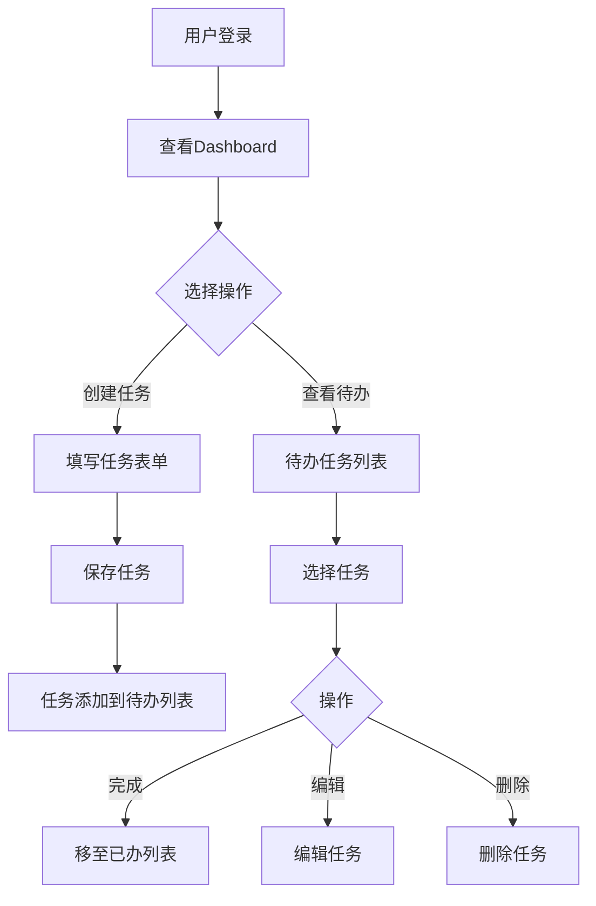
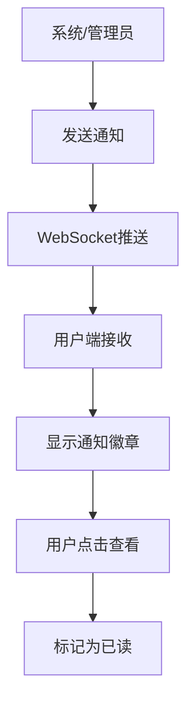

## 1. Product Overview
基于Spring Boot和Vue的企业级管理系统，提供全局消息实时推送和任务管理功能。
- 核心功能：实时消息推送、待办/已办任务管理、全局通知系统
- 目标用户：企业内部员工、团队管理者

## 2. Core Features

### 2.1 User Roles
| Role | Registration Method | Core Permissions |
|------|---------------------|------------------|
| Admin | System creation | Full system management, user management, message broadcast |
| User | Admin invitation | View notifications, manage personal tasks, receive messages |

### 2.2 Feature Module
1. **Dashboard**: 首页仪表板，显示待办统计、通知概览
2. **Task Management**: 待办任务列表、已办任务列表、任务创建/编辑/完成
3. **Notification Center**: 全局通知列表、通知详情、标记已读
4. **Message Push**: 实时消息推送、消息广播
5. **User Management**: 用户列表、角色管理

### 2.3 Page Details
| Page Name | Module Name | Feature description |
|-----------|-------------|---------------------|
| Dashboard | Statistics | 待办数量、已完成数量、通知数量统计卡片 |
| Dashboard | Quick Actions | 快速创建任务、查看最新通知 |
| Task Management | Todo List | 待办任务列表，支持筛选、排序、分页 |
| Task Management | Done List | 已完成任务列表，支持筛选、排序、分页 |
| Task Management | Task Form | 创建/编辑任务表单 |
| Notification Center | Notification List | 通知列表，按时间排序，支持标记已读 |
| Notification Center | Notification Detail | 通知详情弹窗 |
| Message Push | Real-time Messages | WebSocket实时消息推送显示 |
| Message Push | Broadcast | 管理员广播消息功能 |
| User Management | User List | 用户列表管理 |

## 3. Core Process

### 3.1 Task Management Flow

### 3.2 Notification Flow

## 4. User Interface Design

### 4.1 Design Style
- **Primary Color**: #1890ff
- **Secondary Colors**: #52c41a, #faad14, #f5222d
- **Button Style**: Rounded corners, gradient hover effects
- **Font**: Inter, sans-serif
- **Layout**: Sidebar navigation + Main content area
- **Icon Style**: Lucide icons

### 4.2 Page Design Overview
| Page Name | Module Name | UI Elements |
|-----------|-------------|-------------|
| Dashboard | Cards | Statistic cards with icons |
| Task Management | List | Table layout with checkbox |
| Notification Center | Bell Icon | Animated notification badge |
| Layout | Sidebar | Collapsible sidebar |

### 4.3 Responsiveness
- Desktop-first design
- Mobile adaptive sidebar
- Touch optimization