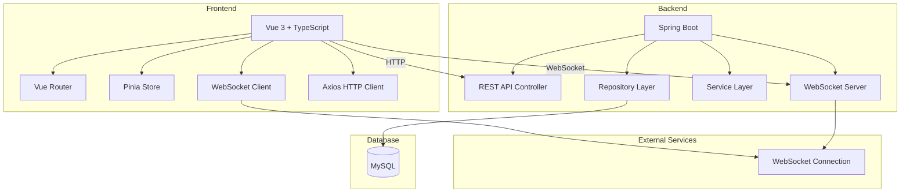
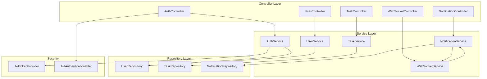

## 1. Architecture Design


## 2. Technology Description
- **Frontend**: Vue 3 + TypeScript + Vite
- **Frontend UI**: Element Plus
- **State Management**: Pinia
- **Routing**: Vue Router
- **Backend**: Spring Boot 3.2.x + Java 21
- **Database**: MySQL 8.0+
- **WebSocket**: Spring WebSocket + STOMP
- **Security**: Spring Security + JWT

## 3. Route Definitions

### Frontend Routes
| Route | Purpose | Component |
|-------|---------|-----------|
| / | Dashboard | Dashboard.vue |
| /tasks | Task Management | TaskList.vue |
| /tasks/todo | Todo Tasks | TaskList.vue (filter=todo) |
| /tasks/done | Done Tasks | TaskList.vue (filter=done) |
| /notifications | Notification Center | NotificationCenter.vue |
| /messages | Real-time Messages | MessageCenter.vue |
| /users | User Management | UserList.vue |

### Backend API Routes
| Method | Route | Controller | Purpose |
|--------|-------|------------|---------|
| POST | /api/auth/login | AuthController | User login |
| POST | /api/auth/logout | AuthController | User logout |
| GET | /api/tasks | TaskController | Get tasks list |
| GET | /api/tasks/{id} | TaskController | Get task by ID |
| POST | /api/tasks | TaskController | Create task |
| PUT | /api/tasks/{id} | TaskController | Update task |
| DELETE | /api/tasks/{id} | TaskController | Delete task |
| PUT | /api/tasks/{id}/complete | TaskController | Mark task as complete |
| GET | /api/notifications | NotificationController | Get notifications |
| GET | /api/notifications/{id} | NotificationController | Get notification detail |
| PUT | /api/notifications/{id}/read | NotificationController | Mark as read |
| POST | /api/notifications/broadcast | NotificationController | Broadcast notification |
| GET | /api/users | UserController | Get users (Admin) |
| POST | /api/users | UserController | Create user (Admin) |
| PUT | /api/users/{id} | UserController | Update user (Admin) |
| DELETE | /api/users/{id} | UserController | Delete user (Admin) |

## 4. API Definitions

### Auth API
**POST /api/auth/login**
```typescript
interface LoginRequest {
  username: string
  password: string
}

interface LoginResponse {
  token: string
  user: User
}
```

### Task API
**GET /api/tasks**
```typescript
interface TaskQuery {
  status?: 'TODO' | 'DONE'
  priority?: 'HIGH' | 'MEDIUM' | 'LOW'
  page?: number
  size?: number
}

interface Task {
  id: number
  title: string
  description: string
  priority: 'HIGH' | 'MEDIUM' | 'LOW'
  status: 'TODO' | 'DONE'
  deadline: string
  createdAt: string
  updatedAt: string
  userId: number
}
```

**POST /api/tasks**
```typescript
interface CreateTaskRequest {
  title: string
  description?: string
  priority: 'HIGH' | 'MEDIUM' | 'LOW'
  deadline: string
}
```

### Notification API
**GET /api/notifications**
```typescript
interface Notification {
  id: number
  title: string
  content: string
  type: 'INFO' | 'WARNING' | 'ERROR' | 'SUCCESS'
  isRead: boolean
  createdAt: string
  userId?: number
}
```

**POST /api/notifications/broadcast**
```typescript
interface BroadcastRequest {
  title: string
  content: string
  type: 'INFO' | 'WARNING' | 'ERROR' | 'SUCCESS'
  userId?: number
}
```

### User API
```typescript
interface User {
  id: number
  username: string
  email: string
  role: 'ADMIN' | 'USER'
  createdAt: string
}
```

## 5. Server Architecture Diagram


## 6. Data Model

### 6.1 Data Model Definition
```mermaid
erDiagram
    USERS ||--o{ TASKS : owns
    USERS ||--o{ NOTIFICATIONS : receives
    
    USERS {
        int id PK
        varchar username UK
        varchar email UK
        varchar password
        varchar role
        datetime created_at
        datetime updated_at
    }
    
    TASKS {
        int id PK
        varchar title
        text description
        varchar priority
        varchar status
        date deadline
        int user_id FK
        datetime created_at
        datetime updated_at
    }
    
    NOTIFICATIONS {
        int id PK
        varchar title
        text content
        varchar type
        boolean is_read
        int user_id FK nullable
        datetime created_at
    }
```

### 6.2 Data Definition Language

```sql
CREATE TABLE users (
    id BIGINT AUTO_INCREMENT PRIMARY KEY,
    username VARCHAR(50) NOT NULL UNIQUE,
    email VARCHAR(100) NOT NULL UNIQUE,
    password VARCHAR(255) NOT NULL,
    role VARCHAR(20) NOT NULL DEFAULT 'USER',
    created_at DATETIME NOT NULL DEFAULT CURRENT_TIMESTAMP,
    updated_at DATETIME NOT NULL DEFAULT CURRENT_TIMESTAMP ON UPDATE CURRENT_TIMESTAMP
);

CREATE TABLE tasks (
    id BIGINT AUTO_INCREMENT PRIMARY KEY,
    title VARCHAR(200) NOT NULL,
    description TEXT,
    priority VARCHAR(20) NOT NULL DEFAULT 'MEDIUM',
    status VARCHAR(20) NOT NULL DEFAULT 'TODO',
    deadline DATE,
    user_id BIGINT NOT NULL,
    created_at DATETIME NOT NULL DEFAULT CURRENT_TIMESTAMP,
    updated_at DATETIME NOT NULL DEFAULT CURRENT_TIMESTAMP ON UPDATE CURRENT_TIMESTAMP,
    FOREIGN KEY (user_id) REFERENCES users(id) ON DELETE CASCADE
);

CREATE TABLE notifications (
    id BIGINT AUTO_INCREMENT PRIMARY KEY,
    title VARCHAR(200) NOT NULL,
    content TEXT NOT NULL,
    type VARCHAR(20) NOT NULL DEFAULT 'INFO',
    is_read BOOLEAN NOT NULL DEFAULT FALSE,
    user_id BIGINT,
    created_at DATETIME NOT NULL DEFAULT CURRENT_TIMESTAMP,
    FOREIGN KEY (user_id) REFERENCES users(id) ON DELETE SET NULL
);

INSERT INTO users (username, email, password, role) VALUES 
('admin', 'admin@example.com', '$2a$10$N9qo8uLOickgx2ZMRZoMye.IjzqAKL9xL5jvMFVdNJHvGCgTq/VEq', 'ADMIN');
```

## 7. WebSocket Configuration

### STOMP Endpoints
| Endpoint | Purpose |
|----------|---------|
| /ws | WebSocket connection endpoint |
| /topic/notifications | Broadcast notifications |
| /user/queue/messages | User-specific messages |

### Message Payload
```typescript
interface WebSocketMessage {
  type: 'NOTIFICATION' | 'MESSAGE' | 'BROADCAST'
  payload: Notification | ChatMessage | BroadcastMessage
}

interface ChatMessage {
  id: number
  senderId: number
  senderName: string
  content: string
  timestamp: string
}
```

## 8. Security Configuration

### JWT Token
- Token Expiration: 24 hours
- Secret Key: Environment variable
- Header: Authorization: Bearer {token}

### Permissions
| Role | Accessible Routes |
|------|-------------------|
| ADMIN | All routes |
| USER | /dashboard, /tasks, /notifications, /messages |